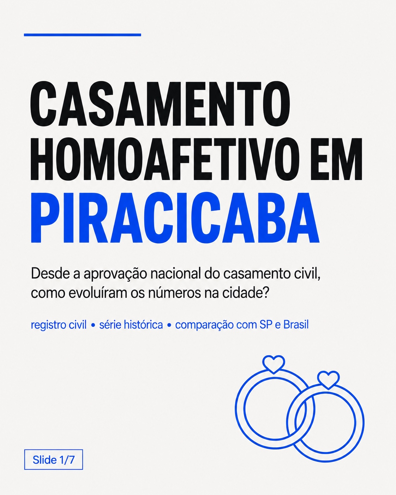
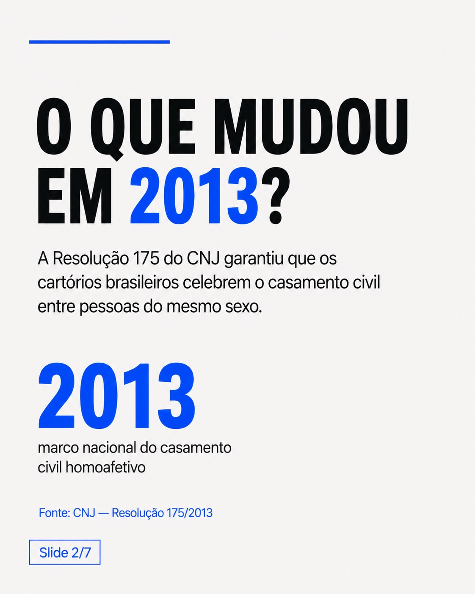
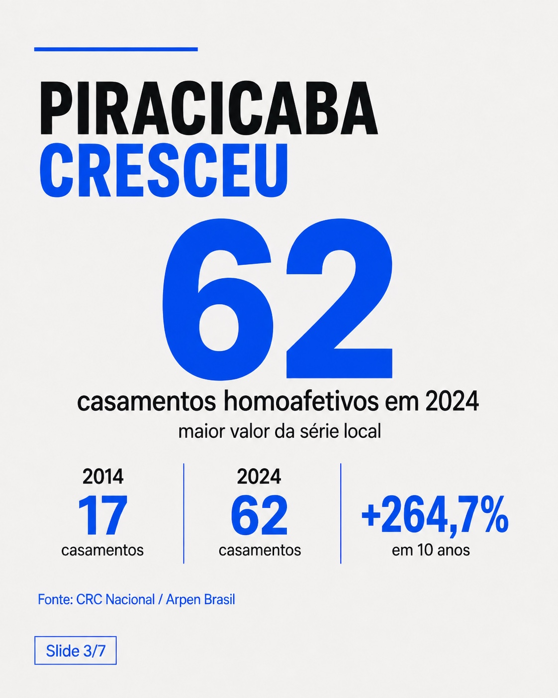
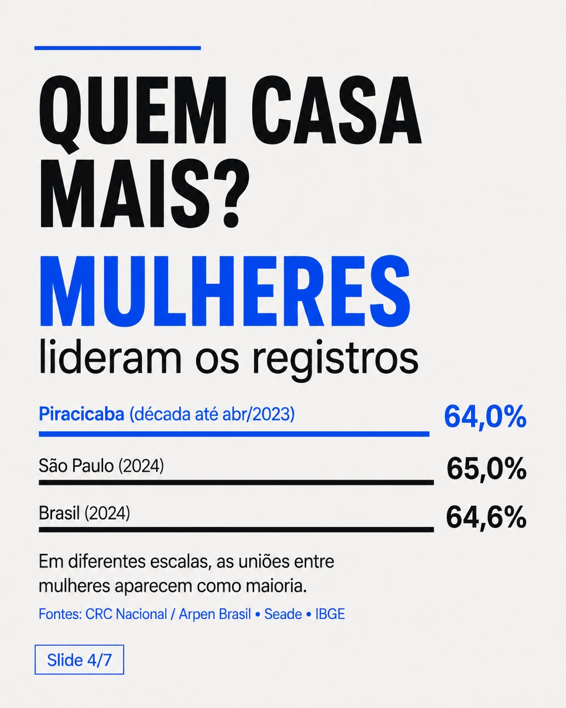
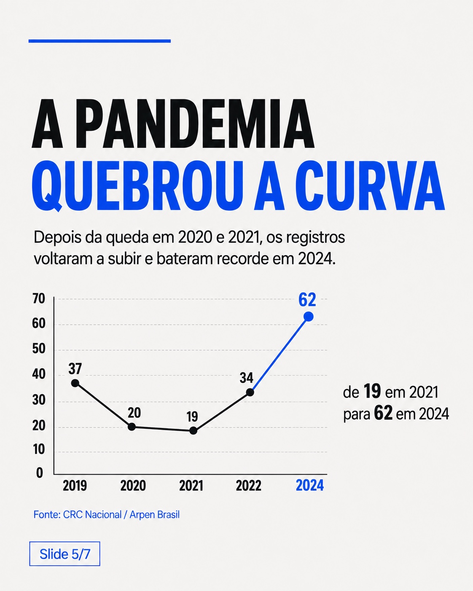
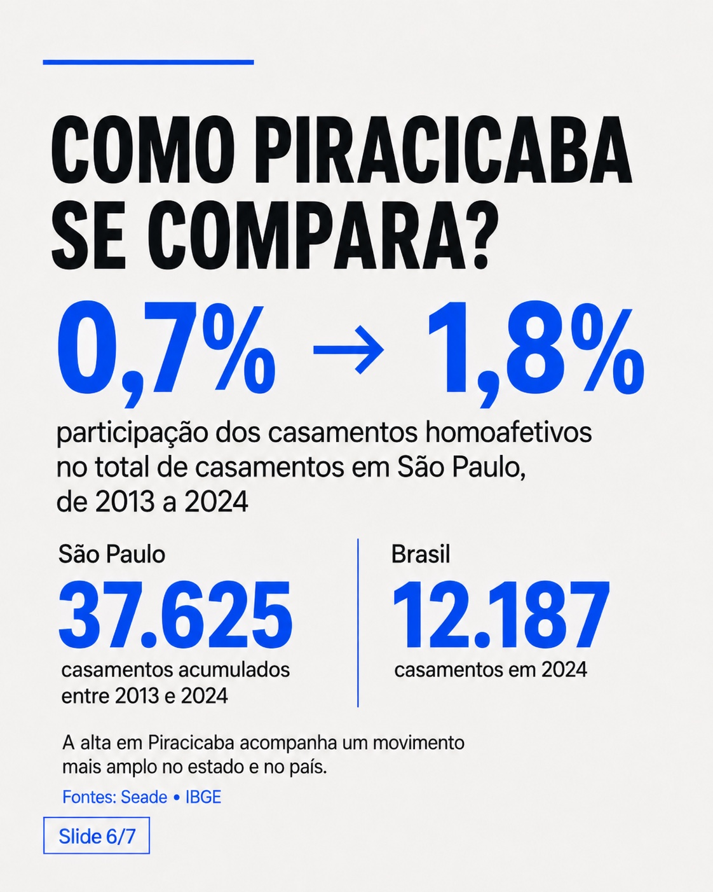
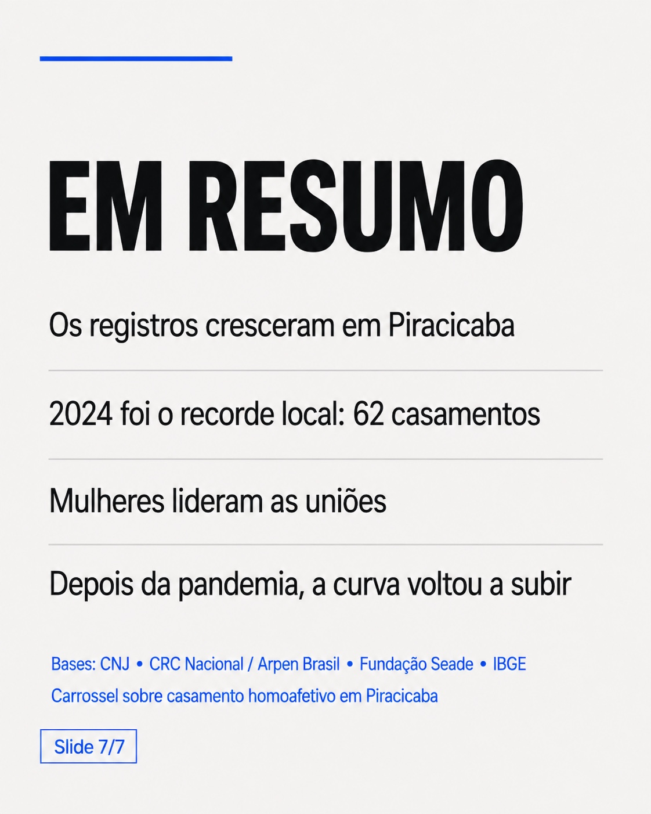

# Same-Sex Civil Marriages in Piracicaba

A local data story about how civil marriages between same-sex spouses evolved in Piracicaba, Brazil, after the nationwide standardization introduced by CNJ Resolution 175/2013.

[Versão em português](README.pt-BR.md)



## Research question

**How did same-sex civil marriage registrations evolve in Piracicaba after the 2013 nationwide standardization, and how does the local pattern compare with São Paulo state and Brazil?**

The project combines a local time series reported from CRC Nacional / Arpen-Brasil with official legal and demographic sources from CNJ, Fundação Seade and IBGE. It documents the numbers behind the seven-slide carousel and, importantly, the limits and conflicts in those sources.

## Why 2013 matters

CNJ Resolution 175/2013 prohibited Brazilian registry offices from refusing the habilitation, celebration or conversion of a stable union into a civil marriage for two people of the same sex. It entered into force in May 2013. Earlier STF and STJ decisions had already established legal foundations, so this repository does not describe 2013 as the "creation" of same-sex marriage.

## Main findings

- Piracicaba recorded **37** same-sex marriages in 2019, **20** in 2020 and **19** in 2021. The local count recovered to **34** in 2022 and reached **62** in 2024, reported as the highest local value in the cited 2025 source.
- The 2019→2020 change is about **-45.9%**. The pandemic coincides with the break in the series, but the analysis is descriptive and does not attribute the decline to a single cause.
- In the accumulated local sample through April 2023, **153 of 239** registrations were between two women, about **64.0%**.
- São Paulo recorded **37,625** same-sex civil marriages accumulated from 2013 to 2024. Their share of all state marriages rose from **0.7%** to **1.8%**; **65%** of same-sex marriages in 2024 were between two women.
- Brazil recorded **12,187** same-sex marriages in 2024, up **8.8%** from 11,198 in 2023; **64.6%** were between two women.

## Data validation note

Two local reports disagree on the early baseline. The detailed 2023 CRC/Arpen sequence reports **2013=17 and 2014=22**. A 2025 article uses **2014=17** to describe growth above 250% over ten years. The carousel preserves the published 17→62 / +264.7% graphic exactly as supplied, but this repository does **not** treat the 2014=17 baseline as validated.

For the machine-readable series, 2014 is stored as **22**, with the conflict documented in [`docs/data-validation.md`](docs/data-validation.md).

The cited 2023 article also reports **12 registrations through April 2023**. That is a partial-year value. The CSV intentionally leaves the full-year 2023 count blank and does not use 12 as an annual total.

## What the data does — and does not — measure

These statistics represent civil-registration events between spouses recorded as the same sex. They do not estimate sexual orientation, gender identity, the number of LGBTQIA+ residents, the total number of same-sex couples, or social acceptance. The project also does not claim a Piracicaba ranking among cities in the interior of São Paulo because no complete municipal comparison base is used here.

## Carousel

The seven images below are the original supplied artwork, stored without visual edits.

### 1. Research question


### 2. The 2013 legal milestone


### 3. Piracicaba reaches a local high


### 4. Female couples are the majority in the compared samples


### 5. The pandemic-period break


### 6. São Paulo and Brazil context


### 7. Summary


## Repository structure

```text
assets/carousel/          original seven carousel images
data/piracicaba_series.csv
data/comparison_metrics.csv
docs/methodology.md
docs/sources.md
docs/data-validation.md
src/validate_metrics.py
```

## Reproducibility

The validation script uses only Python's standard library:

```bash
python src/validate_metrics.py
```

It recalculates the derived percentages, checks the key annual values, verifies that 2023 is not stored as a complete year, and prints the unresolved 2014 conflict as a warning.

## Sources

- CNJ — Resolution 175/2013
- Fundação Seade — *Panorama dos casamentos civis de pessoas do mesmo sexo* (June 2025)
- IBGE — *Estatísticas do Registro Civil 2024*
- CRC Nacional / Arpen-Brasil figures reproduced by Sampi in 2023 and 2025

Full references and links: [`docs/sources.md`](docs/sources.md).

## Methodological documentation

- [`docs/methodology.md`](docs/methodology.md)
- [`docs/data-validation.md`](docs/data-validation.md)
- [`data/piracicaba_series.csv`](data/piracicaba_series.csv)
- [`data/comparison_metrics.csv`](data/comparison_metrics.csv)

## Author

Gabriel Delvaje — data analysis and data storytelling.
